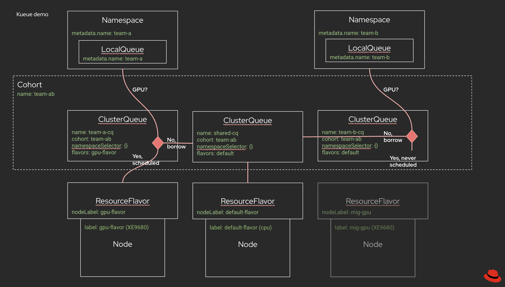

# Kueue Concept Diagram

Components:

1. Namespace: K8s namespace / OCP Project
1. LocalQueue: A LocalQueue is a namespaced object that groups closely related Workloads that belong to a single namespace. A LocalQueue points to one ClusterQueue from which resources are allocated to run its Workloads. <https://kueue.sigs.k8s.io/docs/concepts/local_queue/>
1. ClusterQueue: A ClusterQueue is a cluster-scoped object that governs a pool of resources such as pods, CPU, memory, and hardware accelerators. <https://kueue.sigs.k8s.io/docs/concepts/cluster_queue/>
1. Cohort: A cluster-scoped resource for organizing quotas. ClusterQueues within the same Cohort can share resources with each other. <https://kueue.sigs.k8s.io/docs/concepts/cohort/>
1. ResourceFlavor: An object that defines available compute resources in a cluster and enables fine-grained resource management by associating workloads with specific node types. <https://kueue.sigs.k8s.io/docs/concepts/resource_flavor/>

